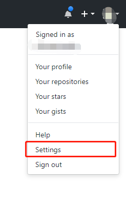
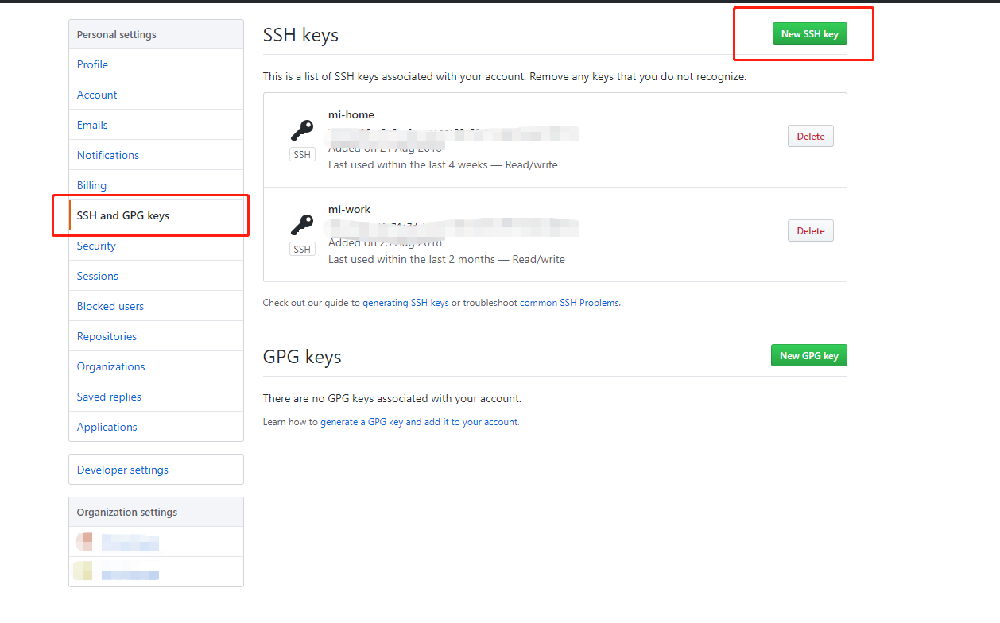
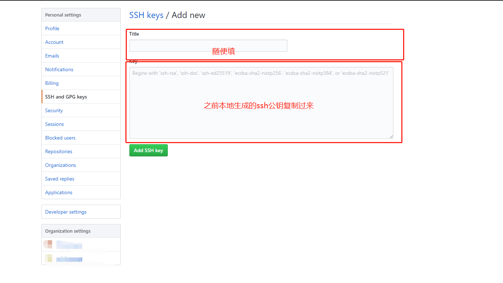

# git配置

## SSH Key
### 在本地生成SSH Key
在命令行中输入
```
$ ssh-keygen -t rsa -C "自己的git邮箱"
```
会询问你秘钥保存的位置
以及设置密码（直接按回车设置空密码）

### 查看生成的公钥
进入上一步中提示或者自己选择的秘钥保存路径，找到<font color="#FF6347">.pub</font>文件，打开查看公钥
或者
```
$ cat ~/.ssh/***.pub
```

### 添加SSH Key到远程仓库
本手册简绍常用的两个git仓库管理系统
#### github添加SSH Key
点击自己的头像，选择setting

选择new ssh key,增加一个ssh key


ok!!!完成
