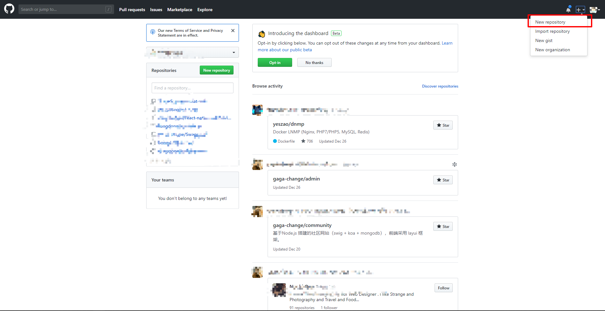
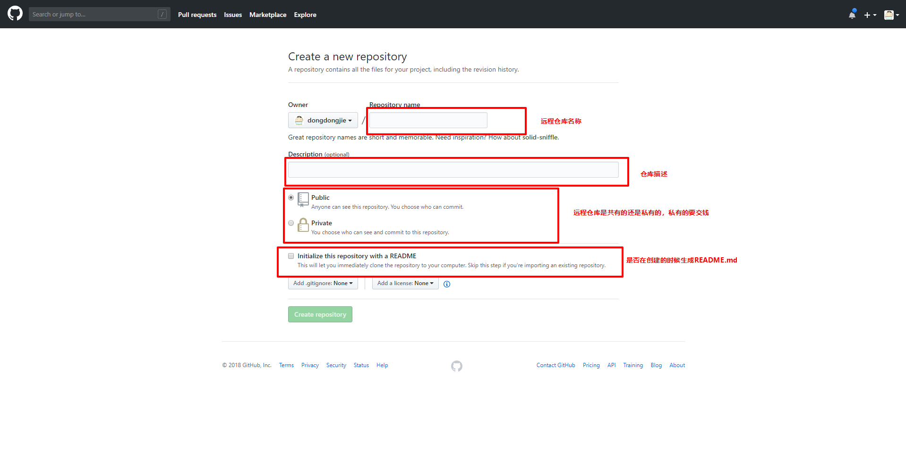
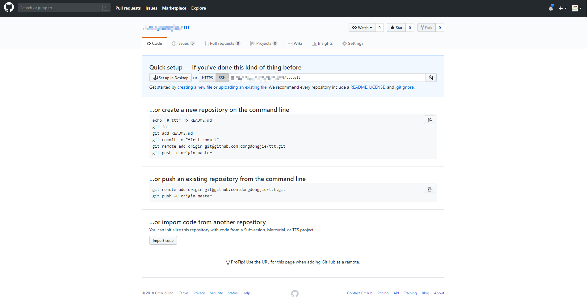
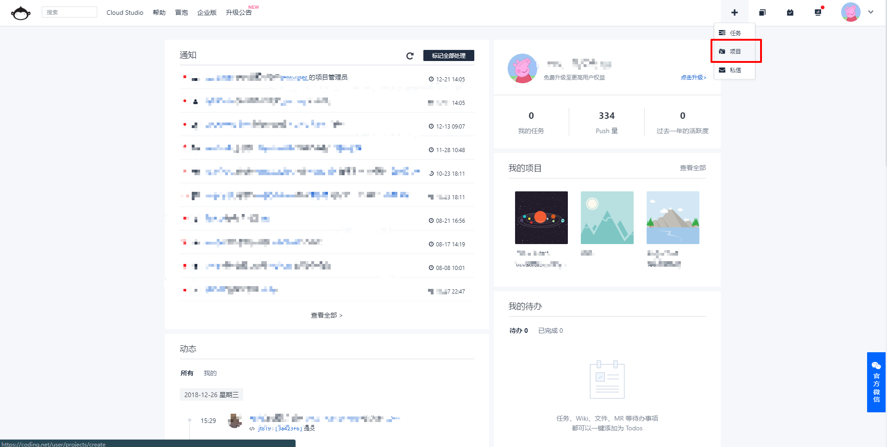
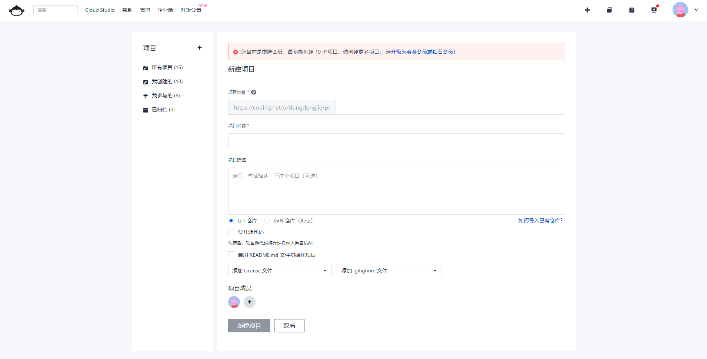

# 远程仓库
前面写了如何创建一个本地仓库，然而实际项目中，我们需要一个远程仓库和本地仓库进行同步，这样我们本地修改的东西，别人也能
通过远程仓库看到。
## 创建远程仓库
第三方的远程仓库服务商有很多，比如用户量很大的几个：  
[github](https://github.com/)  
[coding](https://coding.net/)

### github的创建仓库方法
进入github，点击右上角的<font color="#FF6347">+</font>,选择 <font color="#FF6347">New repository</font>

填写远程仓库信息，然后点击创建

成功之后，会跳转到下面页面，创建成功(<font color="#FF6347">ps: 栗子里是选择不创建README.md，如果选择创建README.md的选项跳转的页面不一样</font>)


### coding的创建方法
进入coding,点击右上角的<font color="#FF6347">+</font>,选择 <font color="#FF6347">项目</font>

填写完仓库信息，点击创建

创建成功之后，跳转到下面页面,创建成功


## 本地仓库关联远程仓库地址
```
$ git remote add 本地仓库名(随意，一般使用origin) 远程仓库地址
```
关联之后，一般会使用下面的命令把本地的内容推送到远程仓库并关联远程仓库的分支
```
$ git push -u 本地仓库名 远程的分支

```
## 从远程仓库克隆
```
$ git clone 远程仓库地址 (本地项目名称,可省略)
```
